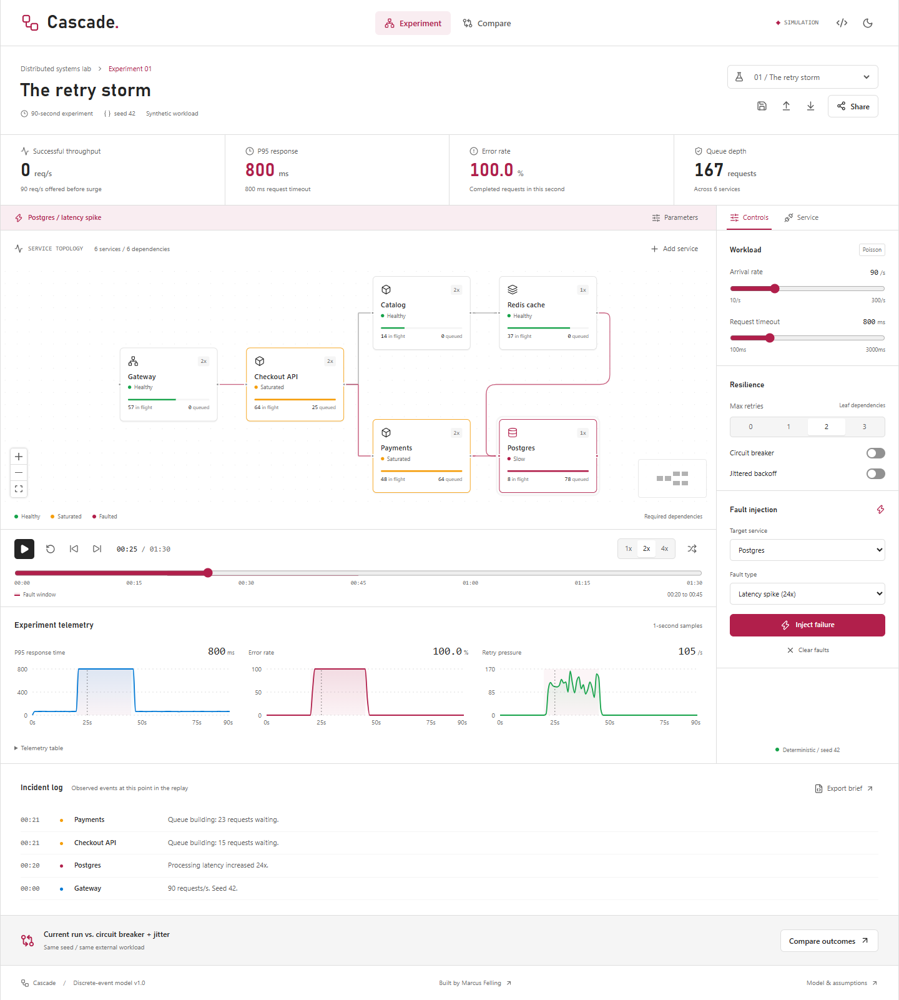

# Cascade

A distributed-systems lab that runs in your browser. Edit a service topology, inject a failure, and replay the incident. Compare resilience controls against the same external workload.

[Open the lab](https://marcusfelling.github.io/cascade/) | [Build and test runs](https://github.com/MarcusFelling/cascade/actions)



## Try the retry storm

1. Open **The retry storm** and start the replay. At 20 seconds, Postgres processing time increases 24x for 25 seconds.
2. Scrub the timeline through the fault. Inspect the queues, retry pressure, errors, and recovery after 45 seconds.
3. Open **Compare** to test circuit breaking with jittered backoff against the same arrival times. Compare successful requests as well as retry reduction; fast rejection also counts as failure.
4. Apply the comparison, change capacity, or inject a different fault. Export an incident brief or share the configuration as a link.

The other bundled experiments cover a traffic surge, a cache outage, and a slow payment dependency.

## Run locally

Use Node.js 24 and npm.

```sh
npm ci
npm run dev -- --host 127.0.0.1
```

Open `http://127.0.0.1:5173/cascade/`. Vite chooses another port if 5173 is in use; use the URL it prints.

```sh
npm run lint
npm run format:check
npm test
npm run build
npm run test:e2e
```

The browser suite runs the production build in Microsoft Edge at desktop and mobile viewport sizes. Install Edge first, or run `npx playwright install msedge`. Linux CI installs its browser dependencies with `npx playwright install --with-deps msedge`.

## Explore an experiment

- Drag services on desktop or use the service inspector on either screen size. Edit replicas, concurrency, processing latency, and cache hit rate. Add services and dependencies; validation rejects cycles and disconnected services.
- Set offered traffic, request timeouts, retry counts, circuit breaking, and jitter. Inject a latency spike, outage, or traffic surge at the replay cursor. A new injection replaces the scheduled fault; **Clear faults** removes it.
- Play at 1x, 2x, or 4x, step a second at a time, or scrub the completed simulation. Space toggles playback and R resets it when focus is outside a control.
- Inspect one-second telemetry in charts or a keyboard-scrollable table. Reduced-motion settings start the replay paused and disable request animations.
- Save a configuration in local browser storage, import or export JSON, or download a Markdown comparison brief containing the measured results and full configuration.

## Architecture

| Area                                  | Responsibility                                                               |
| ------------------------------------- | ---------------------------------------------------------------------------- |
| `src/simulation/schema.ts`            | Zod schema, graph validation, resource bounds, and bundled experiments       |
| `src/simulation/engine.ts`            | Deterministic simulation using the simts discrete-event scheduler            |
| `src/simulation/simulation.worker.ts` | Current and comparison runs in a dedicated worker                            |
| `src/simulation/useSimulation.ts`     | Worker lifecycle, cancellation, timeout, and result state                    |
| `src/simulation/sharing.ts`           | Bounded URL/JSON inputs, local restore, and incident briefs                  |
| `src/components/Topology.tsx`         | React Flow graph, service state, and request animation                       |
| `src/components/Telemetry.tsx`        | Recharts plots and the telemetry table                                       |
| `tests/lab.spec.ts`                   | Production-browser workflows, responsive checks, and axe accessibility scans |

The engine completes the experiment before replay begins. The replay clock selects recorded frames; it does not drive the model. A service-position change leaves the simulation cache key unchanged, while a model change terminates any previous worker and recomputes both runs.

Independent seeded random streams drive external arrivals, retries, and each service. Changing resilience controls preserves external arrival times. Service execution can differ between runs because the controls change which work reaches each service. Reproduction requires the same configuration and model version.

## Model boundaries

Use Cascade to explore failure mechanisms, not to predict production capacity or availability.

| Mechanism       | Model                                                                                                                                            |
| --------------- | ------------------------------------------------------------------------------------------------------------------------------------------------ |
| Traffic         | Exponential interarrival times at the configured rate. A surge changes the rate used for subsequent arrival scheduling.                          |
| Capacity        | Replicas multiplied by concurrency per replica, with an 80-request waiting limit per service.                                                    |
| Processing      | Configured latency multiplied by a seeded uniform factor from 0.65 to 1.35.                                                                      |
| Dependencies    | Each connection is required. A caller occupies a slot while its dependencies execute in parallel.                                                |
| Cache           | A cache hit skips downstream calls. The configured hit probability does not model keys, eviction, or consistency.                                |
| Timeouts        | Each call has a timeout, including queue time. Admitted server work continues after caller timeout; expired queued work does not start.          |
| Retries         | Leaf dependencies only. Fixed delay, or exponential delay with seeded jitter. Open circuits do not retry.                                        |
| Circuit breaker | Shared per leaf service: five consecutive failures, a four-second open interval, and one half-open probe. A successful probe closes the circuit. |
| Faults          | Latency and outage faults affect jobs when service execution begins. Existing processing keeps its scheduled outcome.                            |
| Success rate    | Successful external responses divided by completed external responses. Pending work at experiment end is reported separately.                    |
| P95             | All terminal external responses, including failures and fast rejections. Lower P95 can accompany worse availability.                             |
| Recovery        | The first of three consecutive one-second samples after the final fault with less than 1% errors, some successful throughput, and empty queues.  |
| Peak queue      | Maximum sampled queue in an individual service, not the sum across the topology.                                                                 |

The model has no network transit latency, connection pools, autoscaling, persistent data, idempotency rules, or cross-region behavior. Request dots indicate sampled traffic activity, not individual traced requests. One-second samples can miss shorter spikes.

Experiments allow up to 10 services, 16 dependencies, four faults, and 120 seconds. Base traffic ranges from 10 to 300 requests/s. A two-million-event limit and a 15-second worker timeout bound computation; complex configurations can reach those limits.

## Sharing and privacy

Share links contain a validated UTF-8 Base64URL configuration in the URL fragment. The parser bounds the encoded payload before decoding and does not decompress untrusted data. JSON imports have a 32 KB limit.

URL fragments do not travel in HTTP requests to GitHub Pages, but anyone with the link can read the configuration. Links provide no encryption. Keep experiment names and service labels synthetic. Local saves contain configuration, not credentials or production traffic.

The application has no sign-in, backend, analytics collection, or paid API dependency.

## Deployment

The GitHub Actions workflow checks formatting, lint, unit tests, production compilation, desktop/mobile workflows, and accessibility before publishing pushes to `main`. Pull requests run the same checks without deploying. The deploy job alone receives Pages write and OIDC permissions; action versions are pinned to commit hashes.

GitHub Pages must use **GitHub Actions** as its build source. The Vite base path is `/cascade/`; change it when deploying under a different project path.
